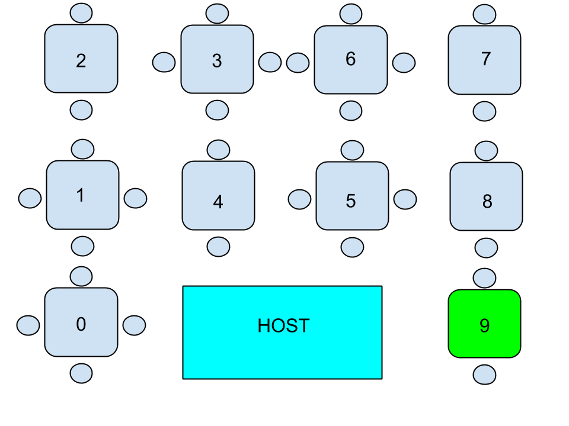

<section markdown="block">
##Branching

|:--:|
| if |
| else |
| elif [Nesting] |

</section>
<section>
	<h1>Indentation Matters!</h1>
</section>
<section>
	<h2>Scenario</h2>
	
</section>
<section>
	<section><h1><a href="ex1.py">Activity 1</a></h1></section>
	<section><h1><a href="ex2.py">Activity 2</a></h1></section>
</section>
<section>
	<h2>Error Handling</h2>
	
try

	
except

</section>
<section>
	<h1><a href="ex3.py">Activity 3</a></h1>
</section>
<section>
	<h2>Looping</h2>
	<table>
	<tbody>
		<tr><td>for</td></tr>
		<tr><td>while</td></tr>
		<tr><td></td></tr>
		<tr><td>break</td></tr>
		<tr><td>continue</td></tr>
		<tr><td>else</td></tr>
	</tbody>
	</table>
</section>
<section>
	<h1><a href="ex4.py">Activity 4</a></h1>
</section>
<section>
	<h2>Functions</h2>
</section>
<section>
	<h1><a href="ex5.py">Activity 5</a></h1>
</section>
